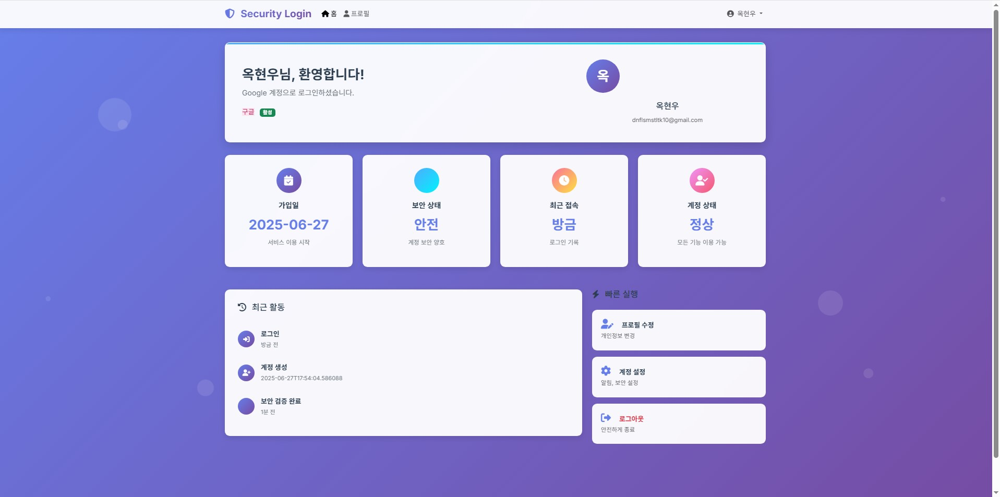
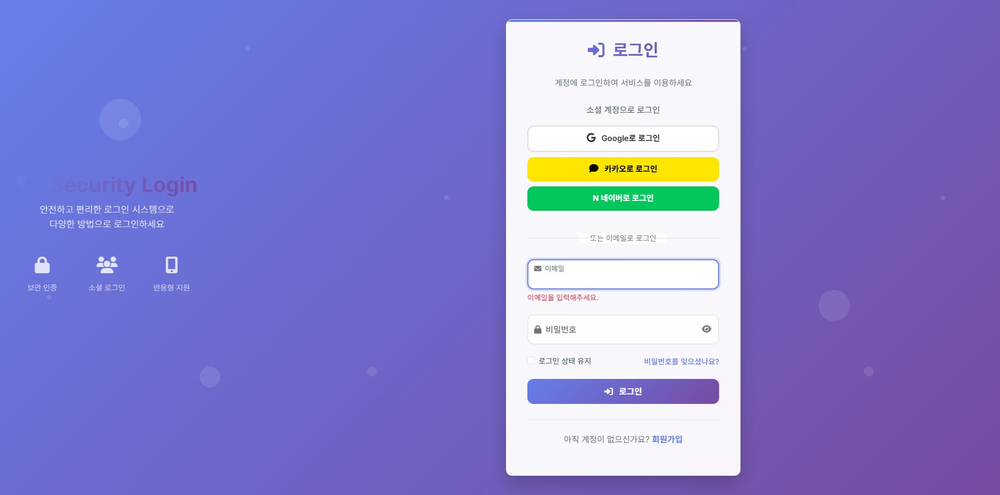
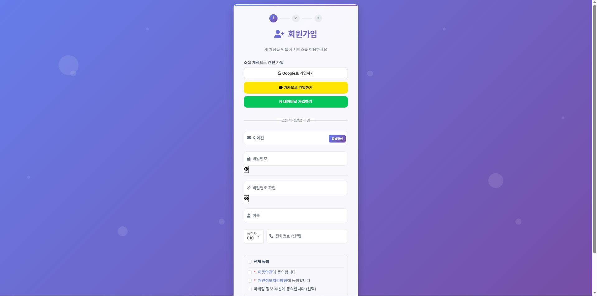
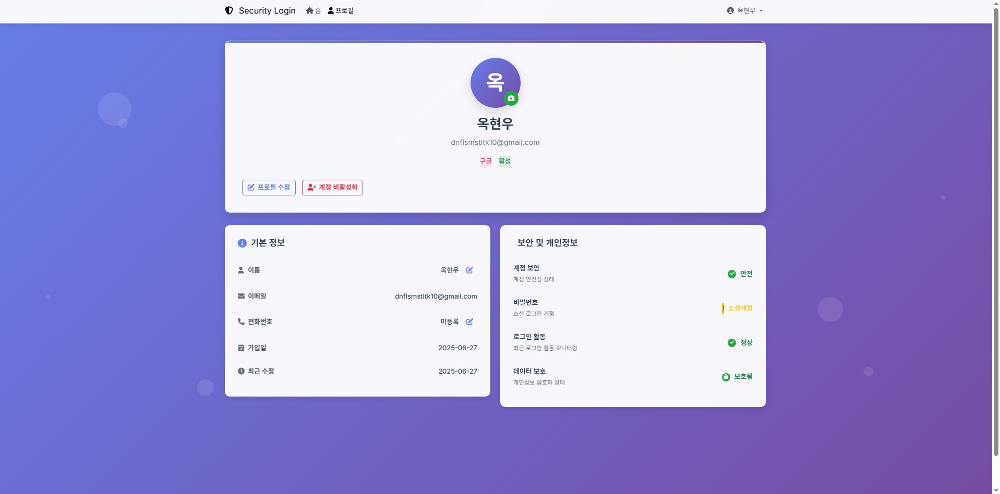

<div align="center">

## 🚀 프로젝트 개요
**Spring Boot를 기반으로 한 웹 애플리케이션으로,<br/>
다양한 소셜 로그인과 일반 회원가입 기능을 제공합니다.**

<br/>

## ✨ 주요 기능
### 🔐 Authentication
- **소셜 로그인**: Google, Kakao, Naver OAuth 2.0 연동
- **일반 로그인**: 이메일/비밀번호 기반 인증
- **회원가입**: 새로운 사용자 등록 시스템
- **프로필 관리**: 개인정보 조회 및 수정

### 📱 페이지 구성
🏠 홈 페이지: 메인 랜딩 페이지
<br/>


🔑 로그인 페이지: 소셜/일반 로그인 선택
<br/>


📝 회원가입 페이지: 새 계정 생성
<br/>


👤 프로필 페이지: 사용자 정보 관리
<br/>


<br/>

## 🛠 Tech Stack
### Backend


### Database


### Frontend


### Development Tools


<br/>

## 🔧 주요 특징
- **🛡️ 보안**: Spring Security를 통한 안전한 인증 시스템
- **🌐 소셜 연동**: 3개 플랫폼 OAuth 2.0 지원
- **📊 데이터베이스**: PostgreSQL을 활용한 안정적인 데이터 관리
- **🎨 UI/UX**: Thymeleaf 서버사이드 렌더링

<br/>

## 📋 개발 환경
```
Java 17+
Spring Boot 3.x
PostgreSQL 15+
IntelliJ IDEA
```

<br/>

## 🎯 학습 목표
이 프로젝트를 통해 **OAuth 2.0 인증 플로우**와 **Spring Security** 활용법을 익히고,<br/>
**실제 서비스에서 사용되는 소셜 로그인 시스템**을 구현해보았습니다.

<br/>


</div>


